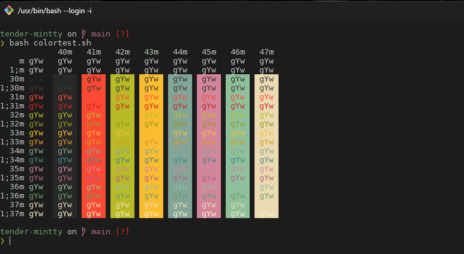
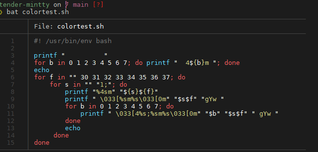

# Tender-mintty

A <a href='https://github.com/mintty/mintty'>mintty</a> color scheme inspired by the <a href='https://github.com/jacoborus/tender.vim'>tender_vim</a> color scheme.

## Installation

You can add the `tender` file to themes directory in `C:\Program Files\Git\usr\share\mintty\themes`

## Screenshots

*Font: DejaVu Sans Mono 10pt* and *Starship*

## Contribution

Please report issues/bugs, feature requests and suggestions for improvements to the [issue tracker](https://github.com/compeng0001/tender-mintty/issues).
